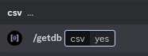
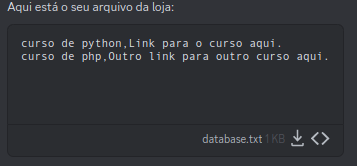

<div align="center">

# HyperBot

**A solução moderna para o mercado digital, com praticidade e simplicidade.**


[](https://discord.gg/M7FURN5R88)


</div>

---

## Sumário

- [Configuração inicial](#configuração-inicial)
- [Começando a usar](#começando-a-usar)


## Configuração inicial

Requisitos:

- Uma *key* para ativar o bot.
- Uma chave SDK do Mercado Pago.
- Um email que você tenha acesso, e que não esteja conectado em uma conta do Mercado Pago.

Se você tem todos esses requisitos, por favor siga os seguintes passos **na ordem:**

- Use o comando `/activate` com a key. Se você digitou corretamente, o bot alertará que a key foi ativada com sucesso.
- Use o comando `/expires` para checar quando sua key vai expirar. Esse comando pode ser usado no futuro quantas vezes você quiser.
- Use o comando `/configurar` com sua **chave SDK** (sdkkey) e **email**.
  - Se você ou um cliente tiverem problemas na tela de pagamento, então a sua **chave SDK** está incorreta ou seu **email** está inválido. Isso significa que você deve usar o comando `/deletarconfig` para deletar a configuração anterior e então usar o comando `/configurar` novamente.
  - Se você quiser receber com outra conta do Mercado Pago, você vai precisar de outra **chave SDK**, e então usar o comando `/deletarconfig` para deletar a configuração anterior  e configurar novamente com `/configurar`.
-  Use o comando `/checar` para checar se o servidor foi configurado corretamente com a **chave SDK** e o **email**.
- A configuração já foi feita e você pode começar a usar o bot!

## Começando a usar

Sempre que um comprador faz uso do BOT através do botão da compra, um novo canal (que apenas o vendedor e o comprador podem ver) deve ser criado para que o comprador prossiga com a compra. Para isso, um categoria com o nome `carrinho` deve ser criada. Além disso, deve ser criado um canal criado `entregas`, e outro chamado `vendas`. No canal `entregas`, serão registrados logs de vendas feitas, sem informações sobre o comprador, e no canal `vendas`, haverá logs com informações sobre o comprador.
**Resumindo, seu servidor precisa ter:**

- **Um canal com o nome `#entregas`**
- **Uma categoria com o nome `#carrinho`**
- **Opcionalmente, um canal com o nome `#vendas`**


## Como obter o token de acesso (chave SDK)

O token de acesso (conhecido como chave SDK nesta documentação) é o que permite que sejam criados novas cobranças de pagamentos em seu nome, e por isso é necessário para a aplicação do HyperBot. Esse token é guardado na base de dados de forma segura o suficiente para que apenas o HyperBot tenha acesso, quando necessário. Veja abaixo como obter este token (dura em torno de 5 minutos!)

1. Você deve ter uma conta no Mercado Pago. Se você ainda não tem, faça o download do app no seu celular e prossiga com a criação da conta, que também não demora mais que 5 minutos. Não tem muita burrocracia e requer poucos passos.
2. Você deve acessar o site oficial do [Mercado Pago.](https://www.mercadopago.com.br/home) Ao entrar no site, será pedido que você faça uma verificação para confirmar a sua identidade, por questões de segurança. Prossiga com a verificação.
3. Após feito isso, você será direcionado para uma página parecida com esta:
   


4. Você deve ir até "Meu negócio", e depois "Configurações", como mostrado no GIF acima.
5. Aparecerá uma tela para configurar aplicação, e você deve preencher da seguinte forma:
  - Em nome da aplicação, coloque o nome da sua loja/negócio.
  - Marque pagamentos online.
  - Marque que você está usando uma plataforma e-commerce.
  - Na opção da plataforma que será usada para integrar, selecione WooCommerce ou Outra Plataforma. Recomendo selecionar outra plataforma.
  - Abaixo da opção acima, selecione CheckoutPro.
  - Marque o botão de confirmação e também "Não sou um robô".


Acima está uma figura detalhando o que você deve fazer.

6. Você deve então ativar as credenciais, e informar alguns detalhes sobre o seu negócio, como segue abaixo.


7. Finalmente, clique em credenciais de produção, e então copie o Access Token, que é a sua chave SDK (ou token de acesso). Agora você já tem sua chave SDK e pode seguir para a [configuração inicial.](#configuração-inicial-e-como-usar)


## Comandos principais

#### ⚙️ /anuncios

Envia um painel para que você gerencie seus anúncios.
Esse comando não possui parâmetros, pois ele já envia um painel interativo, assim como o abaixo:


---

#### ⚙️ /criar_anuncio - `nome`, `descricao`, `imgurl`

Cria um anúncio para sua loja.

- `nome` - O nome (ou título) do anúncio.
- `descricao` - A descrição do anúncio.
- `imgurl` - A URL da thumbnail do anúncio.

---

#### ⚙️ /listar_itens - `anuncio_id`

*Esse comando envia um arquivo .csv contendo todos os itens de um anúncio.*

Em cada linha, existem 3 informações: ID do item, nome do item, e o conteúdo do item, nesta ordem. 

- `anuncio_id` - O ID de um anúncio no seu servidor. Este ID pode ser obtido no painel do comando `/anuncios`.





#### `carregar` - carrega a loja com um arquivo txt ou csv.

Um arquivo txt ou csv deve ser enviado EXATAMENTE antes de usar esse comando.

*Cuidado: esse comando limpa a loja completamente, excluindo TODOS os itens, e então adiciona itens na loja de acordo com o conteúdo do arquivo txt ou csv.* 

**Seu arquivo deve estar no seguinte formato, onde a primeira coluna é o nome dos itens e a segunda é o item em si (o conteúdo do item):**


#### `additens` - comando em manutenção.

Um arquivo txt ou csv deve ser enviado EXATAMENTE antes de usar esse comando.
*Cuidado: esse comando adiciona itens na loja de acordo com o conteúdo do arquivo txt ou csv. Nenhum item anteriormente presente na loja é excluido.* 

**Seu arquivo deve estar no mesmo formato necessário para o comando `/carregar`.**

## Comandos - Configurações

#### `/configurar` - configura o bot com a chave SDK + email.

- **sdkkey** - A chave SDK, que pode ser obtida em ....
- **email** - Um email que você tenha acesso. Não pode ser o mesmo da sua conta do Mercado Pago.

#### `/deletarconfig` - deleta a configuração da chave SDK + email.

*Esse comando deve ser usado quando você pretende reconfigurar o servidor com uma nova chave SDK e email.*

#### `/checar` - checa se o servidor está corretamente configurado com a chave SDK + email.

*Caso tudo esteja certo, o BOT enviará as informações presentes na configuração.*

## Comandos - Keys

#### `/activate` - ativa o servidor com uma key.

- **key** - A key a ser usada.

#### `/expires` - mostra a data de expiração da key atual.

## Keys

Keys são usadas para a ativação da aplicação, com o intuito de manter a organização de forma prática e permitir a distribuição do uso da aplicação. Confira a seguir informaçãoes essenciais sobre as keys:

- Você deve usar apenas uma key e **uma vez** por mês. Se você tem 2 ou mais keys, aguarde até 1 ou 2 dias antes da data de expiração da key para usar uma nova. Se você usar uma key e em seguida usar outra, isso não extenderá o prazo de expiração.
- Uma key funciona só uma vez. Se você tentar usar uma key usada, você vai receber uma mensagem de erro.
- O horário da expiração da key é de acordo com o horário de brasília. Se sua key expira em `22/12/2031`, e são `00:01` do dia `22/12/2031` no horário de brasília, sua key já expirou.
- Nenhum comando ou interação com o bot será possível se o seu servidor não estiver ativado com a key.

## Dúvidas principais 

### Comandos

**Ao usar quaisquer comandos do bot, existem algumas regras principais:**

- Para adicionar quebras de linha na **descrição** de um produto, use "\n". 
Por exemplo:
```
Esse produto contém:
Bananas
Morangos
Uvas
```
Para obter esse tipo de **descrição**, você deve escrever: 
`Esse produto contém:\nBananas\nMorangos\nUvas`.

- Uma **url para thumbnail** SEMPRE deve ser uma página que exibe apenas uma imagem. Exemplo: `https://upload.wikimedia.org/wikipedia/commons/7/74/White_domesticated_duck,_stretching.jpg`
