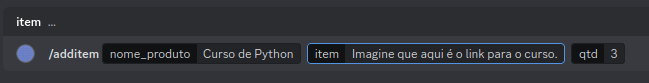
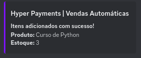
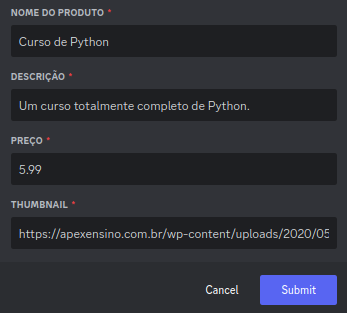
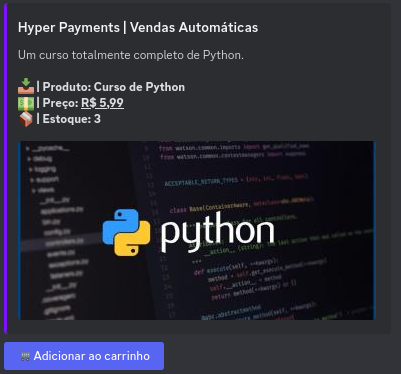
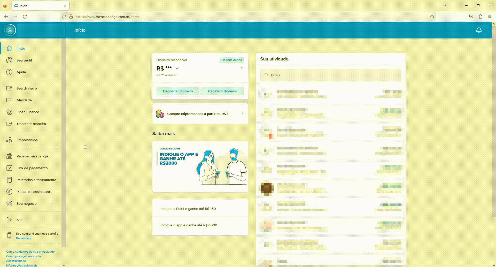
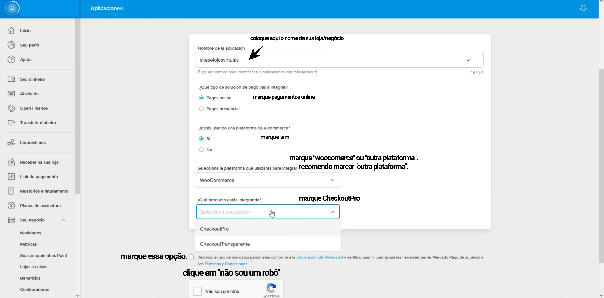
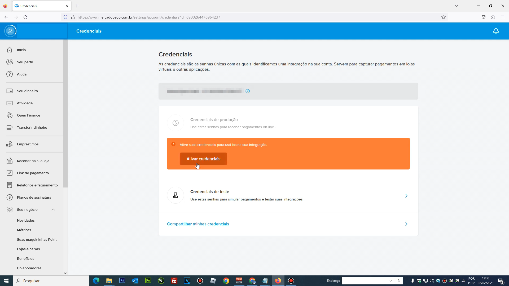
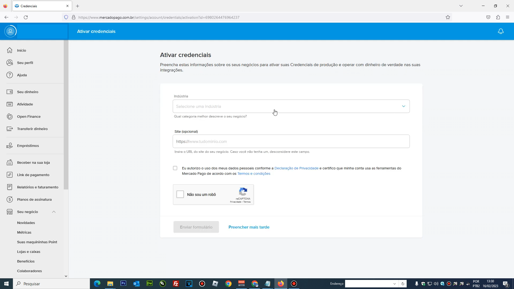
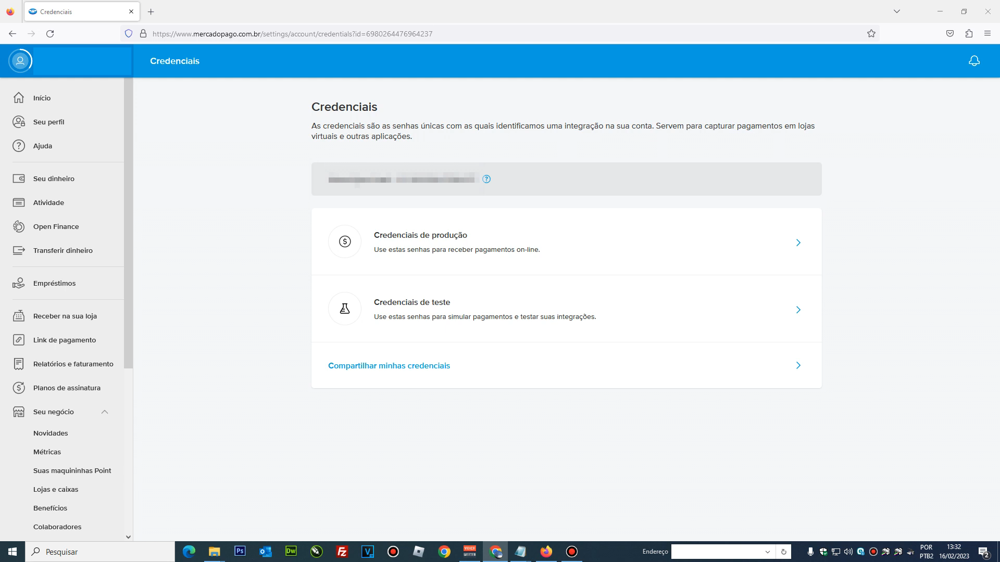
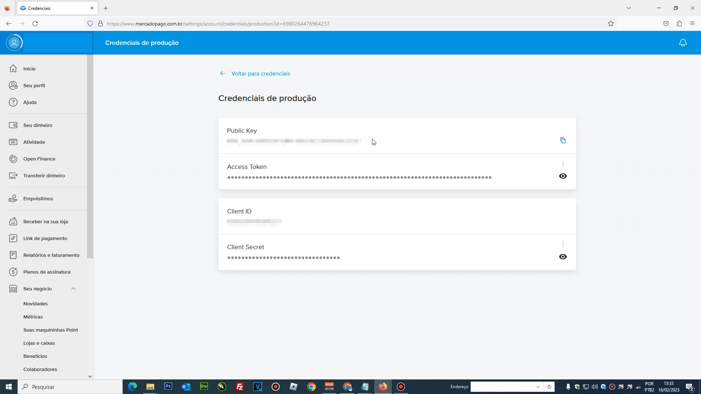

# HyperBot


A solução moderna para o mercado digital, com praticidade e simplicidade.


## Configuração inicial e como usar

Requisitos:

- Uma *key* para ativar o bot.
- Uma chave SDK do Mercado Pago.
- Um email que você tenha acesso, e que não esteja conectado em uma conta do Mercado Pago.

Se você tem todos esses requisitos, por favor siga os seguintes passos **na ordem:**

- Use o comando `/activate` com a key. Se você digitou corretamente, o bot alertará que a key foi ativada com sucesso.
- Use o comando `/expires` para checar quando sua key vai expirar. Esse comando pode ser usado no futuro quantas vezes você quiser.
- Use o comando `/configurar` com sua **chave SDK** (sdkkey) e **email**.
  - Se você ou um cliente tiverem problemas na tela de pagamento, então a sua **chave SDK** está incorreta ou seu **email** está inválido. Isso significa que você deve usar o comando `/deletarconfig` para deletar a configuração anterior e então usar o comando `/configurar` novamente.
  - Se você quiser receber com outra conta do Mercado Pago, você vai precisar de outra **chave SDK**, e então usar o comando `/deletarconfig` para deletar a configuração anterior  e configurar novamente com`/configurar`.
-  Use o comando `/checar` para checar se o servidor foi configurado corretamente com a **chave SDK** e o **email**.
- A configuração já foi feita e você pode começar a usar o bot!

## Começando a usar

1. Crie seu primeiro produto com o comando `/additem`, que cria um produto no estoque e já adiciona conteúdo para ele! Confira mais sobre esse comando em [comandos.](#comandos-principais)




2. Envie uma tabela no estilo Embed para o seu produto com o comando `/enviar`. Vai abrir um prompt para que você configure a sua tabela.





3. E aqui está seu primeiro anúncio! Note que:
 - O título do seu produto ao enviar deve ser exatamente igual ao nome adicionado no estoque. (Letras maiúsculas ou minúsculas não importam)
 - A quantidade disponível no estoque é obtida automaticamente!

## Como obter o token de acesso (chave SDK)

O token de acesso (conhecido como chave SDK nesta documentação) é o que permite que sejam criados novas cobranças de pagamentos em seu nome, e por isso é necessário para a aplicação do HyperBot. Esse token é guardado na base de dados de forma segura o suficiente para que apenas o HyperBot tenha acesso, quando necessário. Veja abaixo como obter este token (dura em torno de 5 minutos!)

1. Você deve ter uma conta no Mercado Pago. Se você ainda não tem, faça o download do app no seu celular e prossiga com a criação da conta, que também não demora mais que 5 minutos. Não tem muita burrocracia e requer poucos passos.
2. Você deve acessar o site oficial do [Mercado Pago.](https://www.mercadopago.com.br/home) Ao entrar no site, será pedido que você faça uma verificação para confirmar a sua identidade, por questões de segurança. Prossiga com a verificação.
3. Após feito isso, você será direcionado para uma página parecida com esta:
   


4. Você deve ir até "Meu negócio", e depois "Configurações", como mostrado no GIF acima.
5. Aparecerá uma tela para configurar aplicação, e você deve preencher da seguinte forma:
  - Em nome da aplicação, coloque o nome da sua loja/negócio.
  - Marque pagamentos online.
  - Marque que você está usando uma plataforma e-commerce.
  - Na opção da plataforma que será usada para integrar, selecione WooCommerce ou Outra Plataforma. Recomendo selecionar outra plataforma.
  - Abaixo da opção acima, selecione CheckoutPro.
  - Marque o botão de confirmação e também "Não sou um robô".



Acima está uma figura detalhando o que você deve fazer.

6. Você deve então ativar as credenciais, e informar alguns detalhes sobre o seu negócio, como segue abaixo.




7. Finalmente, clique em credenciais de produção, e então copie o Access Token, que é a sua chave SDK (ou token de acesso). Agora você já tem sua chave SDK e pode seguir para a [configuração inicial.](#configuração-inicial-e-como-usar)




## Comandos Principais

#### `/enviar` - envia uma tabela para um produto. 
*Um prompt será aberto para que sejam colocadas as informações essenciais, como nome do produto, descrição, preço e url da thumbnail da tabela. 
Para usar esse comando, por favor leia mais informações [aqui.](#dúvidas-principais)*

#### `/additem` - adiciona um item ao estoque de um produto.
*Esse comando deve ser usado quando você quer criar um novo produto ou adicionar um item para um produto já existente.* 
*Parâmetros*
- **nome_produto** - o nome do produto.
- **item** - informações que devem ser enviadas ao usuário quando ele comprar o produto.
- *[opcional]* **qtd** - a quantidade de vezes que esta mesma combinação de produto e item devem ser adicionadas ao estoque. Por padrão, esse valor será 1. Não use um valor maior que 10. Mais informações [aqui.](#dúvidas-principais)

#### `/removeproduto` - remove todos os itens do estoque de um produto.

*Esse comando deve ser usado quando você quer deletar TOTALMENTE o estoque de um produto. A única coisa a ser passada é o **nome_produto** (nome do produto).*

#### `/info` - mostra todas as informações de um produto.

*Esse comando mostra o nome do produto e a quantidade de itens restante no estoque. A única coisa a ser passada é o **nome_produto** (nome do produto).*

#### `/listproduto` - mostra todos os produtos disponíveis na loja.

*Esse comando mostra o nome e a quantidade de itens no estoque de todos os produtos presentes na loja. Nada precisa ser passado.*

#### `/feedback` - comando em manutenção.

#### `/entrega` - registra a entrega de um produto.

*Esse comando registra a entrega de um produto manualmente. 
**Atenção: para que funcione corretamente, no seu servidor deve existir um canal que termine com a palavra entregas. Exemplo: #hyper-entregas, #super-entregas, #entregas, etc..*** 
*Você deve passar para o comando as seguintes informações:*

- **nome_produto** (nome do produto)
- **qtd** (a quantidade de itens de um produto que foi enviada)
- **preco** (o preço do total comprado). `Exemplo: 2.10, 3.15, etc...`
- **data** (a data da entrega do produto). Deve ser colocada no seguinte formato: "dia/mes/ano hora/minuto/segundo"
` Exemplo: 21/02/2023 13:47:15`
- *[opcional]* **avaliacao** (o número no qual sua entrega foi avaliada, deve ser um número de 0 a 5). Se esse número não for passado, a mensagem que aparecerá é "Nenhuma avaliação enviada".
- *[opcional]* **desconto** (o valor do desconto dado) Caso não passado, será igual a 0.00.

#### `/getdb` - devolve um arquivo txt do estoque.

*Esse comando envia um arquivo .txt contendo todos os itens do estoque. Nada precisa ser passado.*

#### `/avaliar` - comando em manutenção.
#### `/removebyid` - comando em manutenção.
#### `/carregar` - comando em manutenção.

## Keys

Keys são usadas para a ativação da aplicação, com o intuito de manter a organização de forma prática e permitir a distribuição do uso da aplicação. Confira a seguir informaçãoes essenciais sobre as keys:

- Você deve usar apenas uma key e **uma vez** por mês. Se você tem 2 ou mais keys, aguarde até 1 ou 2 dias antes da data de expiração da key para usar uma nova. Se você usar uma key e em seguida usar outra, isso não extenderá o prazo de expiração.
- Uma key funciona só uma vez. Se você tentar usar uma key usada, você vai receber uma mensagem de erro.
- O horário da expiração da key é de acordo com o horário de brasília. Se sua key expira em `22/12/2031`, e são `00:01` do dia `22/12/2031` no horário de brasília, sua key já expirou.
- Nenhum comando ou interação com o bot será possível se o seu servidor não estiver ativado com a key.

## Dúvidas principais 

### Comandos
Ao usar quaisquer comandos do bot, existem algumas regras principais:

- O **preço** de um produto SEMPRE deve ser escrito com um ponto e nunca usando vírgula. `Exemplo: 2.15 ao invés de 2,15 para representar R$2,15.`
- Para adicionar quebras de linha na **descrição** de um produto, use "\n". 
Por exemplo:
```
Esse produto contém:
Bananas
Morangos
Uvas
```
Para obter esse tipo de **descrição**, você deve escrever: 
`Esse produto contém:\nBananas\nMorangos\nUvas`.

- Uma **url para thumbnail** SEMPRE deve ser uma página que exibe apenas uma imagem. Exemplo: `https://upload.wikimedia.org/wikipedia/commons/7/74/White_domesticated_duck,_stretching.jpg`
- Em qualquer comando, não é recomendável usar um valor maior que 50 para o parâmetro *qtd*. Se você quer que algum produto tenha um estoque "infinito", é recomendado usar o comando `/additem` com *qtd* igual a 50 quantas vezes forem necessário. Enquanto está sendo executado, não rode nenhum outro comando, e ao terminar, espere 5 segundos e rode novamente.
